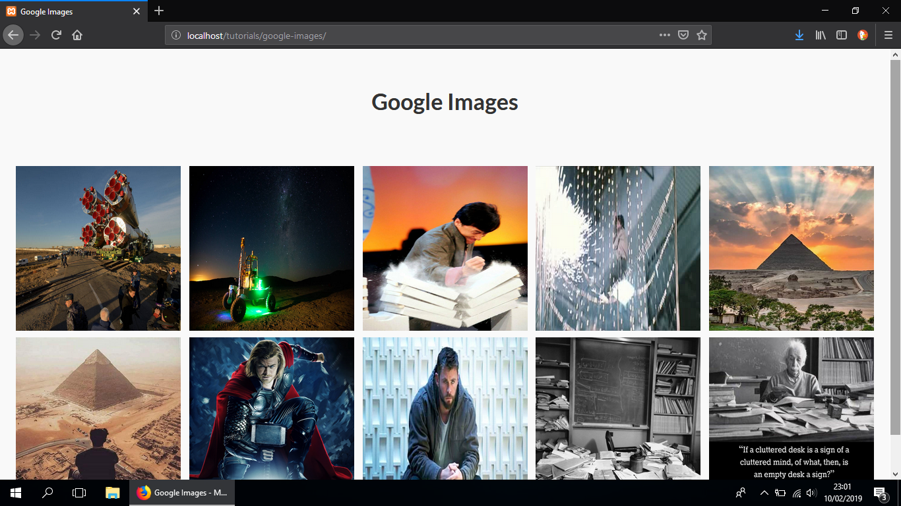
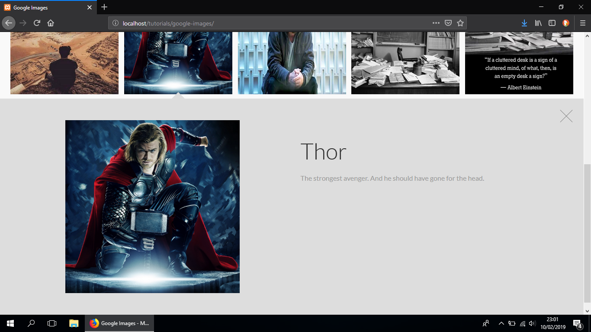

This simple script allows you to show image gallery in your website. The design inspiration came from Google Images.

<h1>Screenshots</h1>

<h1>Installation:</h1>

<ol>
  <li>Copy all the files from <b>assets</b> folder and save in your project folder</li>
  <li>Create a new folder named <b>uploads</b></li>
  <li>Create a new table in your database named <b>images</b> and create following columns:
    <ol>
      <li><b>id</b> INT AUTO_INCREMENT</li>
      <li><b>title</b> TEXT</li>
      <li><b>description</b> TEXT</li>
      <li><b>path</b> TEXT</li>
    </ol>
  </li>
  <li><b>add-image.php</b> file is used to upload pictures (make sure to change database credentials)</li>
  <li><b>index.php</b> is the file used to display image gallery (make sure to change database credentials)</li>
</ol>
